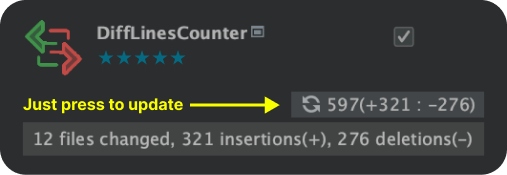
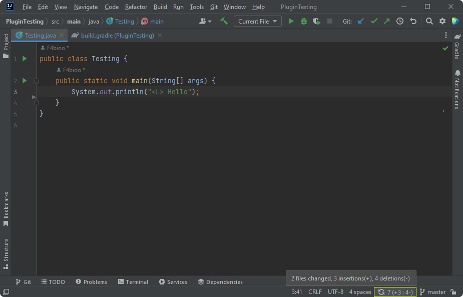

<!-- start description -->
# DiffLinesCounter

The inception of DiffLinesCounter was rooted in the necessity to assess the volume of code modifications prior to submitting a Pull Request (PR), ensuring that the PR remains streamlined and manageable. It's a plugin for IntelliJ IDEA that offers a clear and concise view of the uncommitted changes in your project. With just a glance, you can see how many lines have been added or removed, and how many files have been altered since the last commit. This plugin is perfect for developers seeking immediate feedback on the alterations they are making to the code.

## Features 🚀

- Displays the count of added and removed lines.
- Shows the number of modified files.
- Real-time updates as you modify the code.
- Click to manually update the line count.

## Installation 🔧

1. Navigate to the JetBrains Plugin Repository from your IntelliJ IDEA or use the [link here](https://plugins.jetbrains.com/plugin/22879).
2. In the search bar, type `DiffLinesCounter` and hit enter.
3. Click on `Install` to add the plugin to your IDE.
4. Restart IntelliJ IDEA for the changes to take effect.

## Usage 🛠️

Upon installation, a new widget will be displayed on the IntelliJ IDEA status bar. This widget will update automatically as you modify the code. If you wish, you can click on the widget to manually update the line count.

## Contributing 🤝

Contributions are welcome! Feel free to open an Issue or create a Pull Request.

<!-- end description -->
